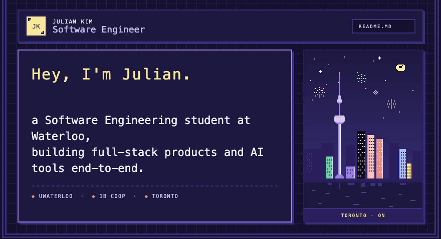
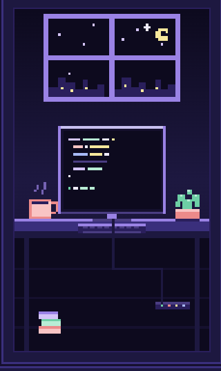

<!-- ====================================================================== -->
<!--                      JULIAN KIM · GITHUB PROFILE                       -->
<!-- ====================================================================== -->

  

<!-- ============================================================ -->
<!-- LIVE STAT BADGES · auto-updating from github & shields.io     -->
<!-- ============================================================ -->

  &nbsp;
  &nbsp;
  &nbsp;
  

<!-- ============================================================ -->
<!-- FIND ME ON · centered row below the hero badges                -->
<!-- ============================================================ -->

  &nbsp;
  &nbsp;
  &nbsp;
  

<!-- ============================================================ -->
<!-- INTRO BLOCK · toolbox on left, pixel art on right              -->
<!-- ============================================================ -->
<table>
<tr>
<td width="62%" valign="top">

##  &nbsp; Toolbox

**Languages**

**Web & Product**

**Data & AI**

</td>
<td width="38%" valign="top" align="center">
  
</td>
</tr>
</table>

<!-- ============================================================ -->
<!-- STATS — live from github                                      -->
<!-- ============================================================ -->

##  &nbsp; Check out my stats

<table>
<tr>
<td width="50%">
  
</td>
<td width="50%">
  
</td>
</tr>
</table>

  

<!-- ============================================================ -->
<!-- SNAKE                                                         -->
<!-- ============================================================ -->

  

  ✦ check out <a href="https://juliankim.dev">my website</a> to learn more about me ✦

